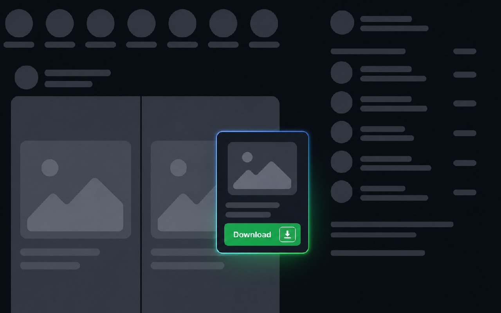

<p align="center">
  
</p>

<h1 align="center">Image Saver</h1>

<p align="center">
  A Chrome (Manifest V3) extension that lets you park the cursor over any image
  on a page and save it with one click — or one keystroke.
</p>

<p align="center">
  
</p>

## How it works

1. Click the Image Saver toolbar icon to toggle **hover mode** ON (the icon gets
   an "ON" badge). Click again to turn it off. Mode is per-tab, active only in
   the tab you clicked from.
2. While ON, move the cursor over an element that contains an image (an ``,
   a CSS `background-image`, or a `<picture>/srcset`) and **stop moving**. After
   a short pause (~200 ms at rest) a floating card appears, anchored where the
   cursor stopped. It shows a thumbnail, the filename, the image's intrinsic
   resolution (e.g. `1200 × 800`) and the action buttons. It does **not** follow
   the mouse, so the buttons are easy to hit.
3. Click **Download**, or just press **`D`** — the image saves straight to your
   default Downloads folder, named from its URL. Press **`C`** (or click
   **Copy**) to put the image on the clipboard instead.
4. Move onto a different image and the popover disappears immediately; stop
   again and a new one appears for that image.

> The toolbar click injects the content script on demand (no manifest
> auto-inject), so the extension works on pages that were already open — you
> don't need to reload the page. When you toggle, a small **green/red toast**
> ("Image Saver ON/OFF") appears at the top of the page as instant confirmation
> the script is live in that tab.

### State is per tab

Each tab has its own ON/OFF state; turning it on in one tab never affects
another. The state is held in `chrome.storage.session`, so it survives the
service worker being shut down and restarted, and is dropped when the browser
closes.

An injected content script does **not** survive a navigation, so the background
re-injects it when a tab that is ON finishes loading. That means a **refresh
keeps working** — the badge and the actual behaviour stay in step.

The one case where the mode turns itself off is a navigation to a **different
origin**: `activeTab` access is revoked at that point, so the extension can no
longer run in that tab. Rather than leave an ON badge over a page where nothing
works, it clears the state and the badge. Click the icon again on the new page.

For the same reason, clicking the icon on a page that can't be injected (a
`chrome://` page, the Web Store) does not light up the badge — there'd be
nothing behind it.

## Loading the extension (unpacked)

1. Open Chrome and go to `chrome://extensions`.
2. Enable **Developer mode** (toggle in the top-right).
3. Click **Load unpacked** and select this folder (`image-saver`).
4. Pin the icon if you like: click the puzzle piece in the toolbar → pin 📌.

## Files

- `manifest.json` — MV3 config; permissions `activeTab`, `storage`, `downloads`,
  `scripting`.
- `content.js` — hover detection, dwell timing, image resolution, popover UI,
  `D` hotkey.
- `background.js` — service worker: toggles mode, updates badge, downloads.
- `generate-icons.js` — squares and downscales `docs/image-saver.png` into
  `icons/icon{16,48,128}.png`. Zero dependencies: the PNG decoder, the box-filter
  resampler and the PNG encoder are all in the file, built on Node's `zlib`.
- `icons/` — the generated `icon*.png` files, which are what `manifest.json`
  ships. Regenerate them with `npm run icons` rather than editing them.
- `docs/` — `image-saver.png` (source artwork), `image-saver-cover.png` (README
  cover) and `store-listing.md` (Chrome Web Store copy).
- `test.html` — a local page to try the extension against.
- `test-content.js`, `test-background.js` — jsdom tests for the hover logic and
  the service worker. Run with `npm install` then `npm test`.

## Development tests

```sh
npm install     # installs jsdom (dev-only)
npm test        # runs the content-script + background test suites
npm run icons   # regenerates icons/icon{16,48,128}.png from docs/image-saver.png

## Manual test

Chrome does **not** run content scripts on `file://` pages unless you enable
"Allow access to file URLs" for the extension. So **don't test by double-clicking
`test.html`** — it will appear to do nothing.

Test against any image-rich HTTPS page instead, e.g. Unsplash or Wikipedia, or
serve the local page over HTTP:

```sh
python3 -m http.server 8123
# then open http://localhost:8123/test.html in Chrome
```

**After editing any extension file, reload the extension**: open
`chrome://extensions` and click the refresh icon on the Image Saver card, then
reload the page you're testing. Otherwise Chrome keeps the old code cached and
your fixes won't show up.

Steps: open your test page, click the Image Saver icon — a green **"Image Saver
ON"** toast appears at the top of the page — then park the cursor on an element
that contains an image, wait for the popover, and click **Download** or press
**`D`**. (No toast on a restricted page like `chrome://` — the extension can't
run there.)

## Debugging

The content script logs lifecycle + state events with `[ImageSaver]` always, and
fine-grained hover details only when verbose debug is enabled:

1. Open the page where images aren't popuping.
2. Open DevTools (F12) → **Console**.
3. Type `window.__imageSaverDebug = true` and press Enter. (If the page source
   reloads, e.g. a SPA nav, re-set it.)
4. Toggle the extension ON — you should see `[ImageSaver] hover mode ON` in the
   **page console** (this one, not the service worker console).
5. Now hover the image. Look for `[ImageSaver]` lines:
   - `mouseover on IMG ` → the hover event fires.
   - `resolveImage:  result for ... -> <url>` → a usable image was found.
   - `show popover: url = ...` → the popover was told to appear.
   - If you see `mouseover ignored (inactive)` then `active` is false in the
     page (toggle isn't syncing).
   - If you see `no image found for ...` then no image URL was resolved.

The service worker also logs via `chrome://extensions` → Service Workers (a
`service-worker` console). Paste the `[ImageSaver]` lines here if it's still not
working.

## Keyboard

| Key | Action |
| --- | --- |
| `D` | Download the image currently shown in the popover |
| `C` | Copy that image to the clipboard |

Both hotkeys stand down whenever focus is in an editable field — `<input>`,
`<textarea>`, `<select>`, anything `contenteditable`, and ARIA widgets with
`role="textbox"`/`searchbox`/`combobox`/`spinbutton`, including fields inside
open shadow roots. They also ignore modified keystrokes, so `Ctrl/Cmd+D` still
bookmarks and `Ctrl/Cmd+C` still copies the page selection.

### What `C` actually copies

The extension holds **no host permissions**, so it can only read an image's
bytes when the page's own origin is allowed to: same-origin images, or
cross-origin ones whose host sends CORS headers. When the bytes are readable the
real bitmap goes on the clipboard (re-encoded to PNG, which is the only image
type Chrome's clipboard accepts). When they aren't, it copies the image **URL**
as text instead — the popover says which of the two happened rather than failing
silently.

Copying the bitmap in every case would require requesting access to all
websites, which is a trade this extension deliberately doesn't make.

## Privacy

Image Saver has no analytics, no telemetry and no remote code, and stores
nothing beyond a per-tab on/off flag in session storage. It requests no host
permissions — only `activeTab`, granted for the one tab whose icon you click.

The only address it ever contacts is the image you asked it to save or copy, and
only at the moment you ask. See [PRIVACY.md](PRIVACY.md).

## Notes / limitations

- One prominent image per element (its own `` or the largest descendant).
- The resolution shown is the image's **intrinsic** size (`naturalWidth` ×
  `naturalHeight`), not the size it happens to be displayed at. For a CSS
  background it can only be measured once the card's own thumbnail has loaded,
  so it appears a moment after the card does.
- The popover is dwell-triggered: it appears only after the pointer has been at
  rest over an image for ~200 ms, never while the mouse is in motion.
- Tiny 1×1 "tracking" images are ignored.
- Some sites block hotlinking or cross-origin images; the download may fail and
  the popover shows "Couldn't download this image".